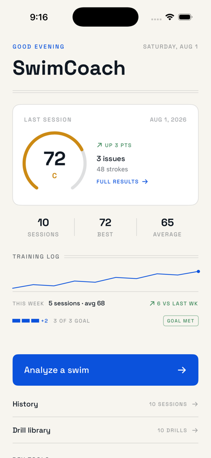
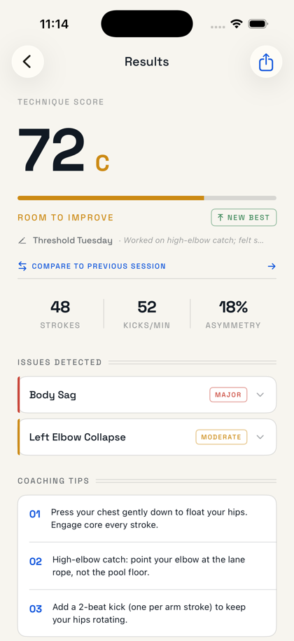
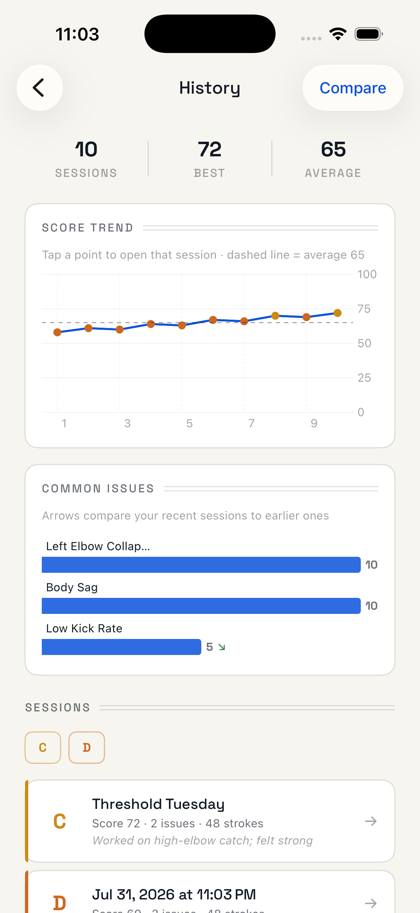

# SwimCoach

An iPhone app that films a freestyle swim and scores its biomechanics —
entirely on device. A temporal convolutional network (SwimTCN) reads pose
keypoints from the video, detects stroke faults like body sag, elbow
collapse, and kick-timing problems, and maps every fault to practice
drills. No account, no upload, no analytics.

<p align="center">
  
  
  
</p>

## What it does

- **Analyze**: record from the pool deck (framing guide + live level
  indicator) or import a video. Vision extracts pose keypoints; SwimTCN
  scores 3-second windows and averages them into a 0–100 technique score
  with a letter grade.
- **See it**: skeleton overlay on the session video, a per-fault timeline
  ("when it happened"), and one-tap seek to where each fault peaked.
- **Share it**: export the video with the skeleton burned in, or a
  1080×1350 report card with your score, faults, and progress sparkline.
- **Improve**: every detectable fault maps to drills in a built-in
  library; sessions carry names and training notes; History charts score
  trend and per-fault direction (improving / worsening).
- **Stay honest**: weekly session goal with progress ticks, personal-best
  detection, week-over-week training log on Home.

## Repository layout

This monorepo is canonical for the whole product:

| Path | What |
|------|------|
| `iOS/` | SwiftUI app (iOS 17+, XcodeGen). Pipeline: `PoseAnalyzer` (Vision) → `FeatureExtractor` → `SwimTCNRunner` (CoreML) → `FeedbackEngine` → SwiftData history. |
| `ml/` | Python pipeline: MediaPipe extraction → windowed SwimTCN → report. Synthetic datagen, training, CoreML conversion. |
| `backend/` | FastAPI Cloud Run service wrapping `ml/` for URL-based analysis. |

The SwimTCN model is the **only** detection path on both platforms — there
is no rule-based fallback. Model contracts (input shape, label order,
coordinate conventions) are documented in [CLAUDE.md](CLAUDE.md), which
also carries the agent-facing build/test/release playbook.

## Quickstart

```bash
# iOS app (needs Xcode; regenerate after any project.yml change)
cd iOS && xcodegen generate
xcodebuild test -project SwimCoach.xcodeproj -scheme SwimCoach \
  -destination 'platform=iOS Simulator,name=iPhone 17 Pro'

# Python tests (fast — numpy/scipy/pytest only)
cd ml && .venv/bin/python -m pytest tests/ -q

# Full CLI analysis on a video (pip install -r requirements.txt first)
cd ml && .venv/bin/python main.py <video.mp4> --output-dir out
```

Note: Vision pose extraction does not run in the iOS simulator — camera
and analysis paths need a physical device. The simulator uses DEBUG
launch arguments (see CLAUDE.md) for demo and screenshot flows.

## Development

Features ship through a release cycle: feature branch → PR with a
CHANGELOG entry → CI green (iOS + Python jobs) → squash-merge → semver
tag → GitHub release → device-verified deploy. See
[CHANGELOG.md](CHANGELOG.md) for the release history.

Type is set in [Space Grotesk](https://fonts.floriankarsten.com/space-grotesk)
by Florian Karsten, used under the SIL Open Font License 1.1
(`iOS/SwimCoach/Resources/Fonts/OFL.txt`).
